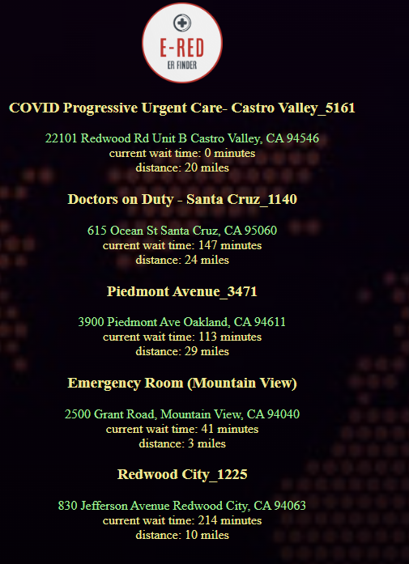

# OWLHACKS PROJECT: E-RED

By Jason Corn, Stevie Carmichael, Kyle Chun, Nathan Le

Find the project here: https://lordofdeadbush.github.io/OwlHacks2022TeamTEN/

E-RED is a web application that allows users to find the nearest Emergency Room locations with minimal user input.

Find a demo video here: https://youtu.be/0u2D-paZwwc

## elevator pitch

E-RED, a website that displays relatively close emergency rooms with low wait times, addresses the US Emergency Department's lengthy wait time, one of the major contributors to the health crisis.

## Inspiration

We came up with this idea from one of our member's experiences as a hospital volunteer. As a volunteer, he frequently visits the emergency room and notices the huge problems with the long wait times. The emergency room was often overcrowded, and some patients would suffer for even an hour before they could get the care they need. Some patients would even leave the ER if the wait was too long. That is why we came up with the website of E-RED, so that potential patients can see the wait times of all the ERs in their area. This can allow them to get the care they need in the quickest time possible and help level the wait times in all ERs around the area so that one is not overburdened.

## What it does

E-RED is a website that provides users with nearby emergy room locations. Its functional modus is the ability to provide users with wait times so that they make informed decisions in emergencies.

## How we built it

When it comes to the technical construction of the project we had to venture far outside of familiar territory. Jason and Stevie are the two technical leads of our team, and not extremely familiar with front-end languages and development. We started by writing some location-accessing software. Stevie built a front-end tool that displays location information to test getting the location from the browser. This tool helped our development progress, giving us a better view of the way location services work. Then we spent our time pulling and parsing huge data sets from various APIs. This was the most challenging portion of the project. We had to make workarounds because of the unsupported and unintuitive structuring of these APIs. Then we tied it all up with an HTML display, showcasing the relevant information and accomplishing most of our technical goals.

## Challenges we ran into

We ran into some difficulties with the API, as we state above.

## Accomplishments that we're proud of

This project was very challenging because the API we were using (ertrack.net), was subject to high latency during testing, and was very difficult for our application to communicate with. We ended up working around the API and using our creativity in order to get accurate data for the wait times.

We are also very proud of the simple UI that we were able to design and implement in this short time.

## What we learned

Our difficulties with the API we were using to get wait times taught us that technologies are far more dependent on their technological underpinnings than one may notice from the surface. 

## What's next for E-RED

- google distance matrix travel time estimations
- restructuring the database so we can take ownership of the data. This includes getting data from 911 dispatchers as well as hospitals.
- implementation of wait time recording so we can predict wait times in the future.
